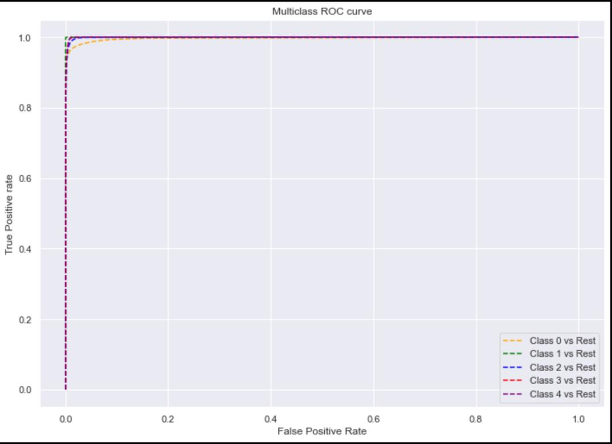

> **Wearable Stress and Affect Detection (WESAD)**

**Final Project Proposal**

**Group -- 24**

> Venkata Sai Prasad Aka\
> Aditya Kondepudi

{width="2.504166666666667in"
height="2.504166666666667in"}

Submission Date: 12/09/2022

**[PROBLEM SETTING:]{.underline}**

The major point that we are addressing in this project is to help users
improve their state of health by intimating medical practitioner their
state of stress or increased stress. An analysis of federal health data
found that 8.3 million American adults, or roughly 3.4 percent of the
population, experience severe psychological discomfort. The researchers
noted that 3 percent or less of Americans were thought to be
experiencing substantial psychological discomfort in previous
estimations. Hence, in this project we are trying to reduce their mental
stress and improving their Mental Health.

**[PROBLEM DEFINITION:]{.underline}**

In this project, we use WESAD which is publicly available dataset for
Wearable Stress and Affect Detection. This multimodal dataset features
physiological and motion data, recorded from both a wrist- and a
chest-worn device, of 15 subjects during a lab study. The following
sensor modalities are included: blood volume pulse, electrocardiogram,
electrodermal activity, electromyogram, respiration, body temperature,
and three-axis acceleration. The goal of the project is to analyze the
data of the population, and to predict whether the person is feeling
stressed or not within a measuring range of five different levels.

**[DATA SOURCE CITATION:]{.underline}**

This dataset was procured from UCI Machine Learning Repository

Data Source Citation:

**[DATA DESCRIPTION:]{.underline}**

There are 63,000,000 instances and 12 attributes in the training data.
The target variable is 'label' which is an ID of respective study
protocol condition. The following IDs are provided: 0 = Transient, 1 =
Baseline, 2 = Stress, 3 = Amusement, 4 = Meditation. The data is a
multivariate time-series with real-valued attributes. The preferred data
operations associated with the dataset are classification and
regression.

**[DATA EXPLORATION:]{.underline}**

The data is in pickle format (.pkl) To be able to perform operations on
the data we use the 'pickle' package to convert the data from pickle to
dictionary format. The dictionary contains 3 main entities -

**Subject:** The dataset contains of 15 patients. 'Subject' notates the
member's medical record that the dataset belongs to.

**Signal**: It describes the body part of which the stress is being
calculated from various attributes. Signal is being calculated from

> a.Chest : It has further medical measurements which are used for
> Stress detection i. ACC\
> ii. ECG\
> iii. EMG\
> EDA iv.
>
> v\. Temp\
> vi. Resp
>
> b.Wrist: It has some other medical measurements of the wrist included
> used for Stress detection\
> i. ACC\
> ii. BVP\
> iii. EDA\
> iv. Temp

ACC is the accelerometer reading, which are being considered in triaxial
orthogonal directions. The triaxial ACC readings are different for chest
and wrist. The notations are different to avoid ambiguity, i.e., for

ACC for Chest : c_ax, c_ay, c_az

ACC for wrist: w_ax, w_ay, w_az

**Label:** The label denotes the target variable for the data mining
operation being performed on the dataset. It indicates the state of the
member in accordance with the stress level the member is in, for the
reading. Each label has a number code. The Labels are:

> i\. 0 -- Baseline\
> ii. 1 -- Stress\
> iii. 2 -- Amusement\
> iv. 3 -- Meditation

**[LABELS DISTRIBUTION IN THE DATA:]{.underline}**

Below is the data distribution of the counts of labels of the first
member

{width="5.415277777777778in"
height="5.388888888888889in"}

**[BALANCING UNBALANCED CHEST DATA:]{.underline}**\
The data samples from chest device are 21 times more than data wrist
device samples causing

an imbalance, due to which the wrist samples must be excluded from the
dataset. Chest device

gives 4255300 samples

Below is the distribution visualization of the unbalanced data of chest
and wrist devices:

{width="6.5in"
height="6.131944444444445in"}

Hence, we convert all the Pickle dictionary records to Dataframe using
Pandas by removing wrist samples. Now we only have chest device data
records.

Once the data is converted to Dataframes we have the following columns
for the data: "c_ax\", \"c_ay\",
\"c_az\",\"c_ecg\",\"c_emg\",\"c_eda\",\"c_temp\",\"c_resp\",\"w_label\"

**[CALCULATING INTERQUARTILE RANGE & REMOVING OUTLIERS:]{.underline}**

We visualize the data below, by using boxplot:

{width="5.569444444444445in"
height="3.611111111111111in"}

In descriptive statistics, the interquartile range (IQR) is the measure
of the spread of the middle half of the data distribution. It is measure
of where the bulk of the values of the data lies.

IQR = Q3 -- Q1 , where IQR = Interquartile Range\
Q3 = 3rd Quartile or the 75th Percentile Q1 = 1st Quartile or the 25th
Percentile

After performing IQR and removing all the outliers, the data is scaled
down to a measurable range. The boxplot visualization is as below:

{width="5.222222222222222in"
height="3.6527777777777777in"}

**[CORRELATION MATRIX:]{.underline}**

Below is the correlation matrix of the data:

{width="5.736111111111111in"
height="2.375in"}

**Heatmap of the data:**

{width="5.597222222222222in"
height="4.236111111111111in"}

**Interpretations:** From the above correlation matrix and heatmap of
the data, the following

interpretations can be made:

> \- c_ax is highly positively correlated with c_az
>
> \- c_eda and c_temp are negatively correlated with each other
>
> \- c_emg and c_ecg are very poorly correlated with the rest of the
> features.

**[HISTOGRAM:]{.underline}**

Below are the distribution of the data:

{width="6.5in"
height="4.661111111111111in"}

**Interpretations:**

We observe that

> \- The IQR is the highest for c_emg & c_ay histograms, followed by
> c_resp and c_ecg
>
> graphs
>
> \- There is a high varied distribution for the c_az histogram
>
> \- A bimodal graph is observed with both c_ax, c_eda histograms
>
> \- c_emg shows a uniform distribution graph

[DIMENSION REDUCTION AND VARIABLE SELECTION]{.underline}

NORMALIZATION

Z-score normalization is a strategy of normalizing data that avoids this
outlier issue. The formula for Z-score normalization is:

(Value−μ)/σ

Here, the mean value of the feature is notated by μ, and the standard
deviation of the feature is notated by σ. If a value exactly equals to
the mean of all the values of the feature, it will be normalized to 0.
On the other hand, if it is below the mean, it will be a negative
number, and positive number if above the mean. The size of those
negative and positive numbers is determined by the standard deviation of
the original feature. If the unnormalized data has a large standard
deviation, the normalized values will be closer to 0.

After normalizing the data, the header rows is as follows:

{width="6.5in"
height="3.1805555555555554in"}

PRINCIPAL COMPONENT ANALYSIS (PCA)

Principal component analysis (PCA) is a common method for analyzing huge
datasets with a high number of dimensions/features per observations,
improving data interpretation while retaining the most information, and
enabling the presentation of multidimensional data. Formally, PCA is a
statistical method for lowering a dataset\'s dimensionality. To do this,
the data are transformed linearly into a new coordinate system, where
(most) of the variance in the data can be expressed with fewer
dimensions than the initial data.

After applying Principal Component Analysis to the dataset, the variance
of the predictor variables is obtained as follows:

{width="5.652777777777778in"
height="1.7083333333333333in"}

[DATA MINING MODELS / METHODS]{.underline}

LOGISTIC REGRESSION

Predictive analytics and categorization frequently make use of this kind
of statistical model, also referred to as a logistic regression model.
Based on a given dataset of independent variables, logistic regression
calculates the likelihood that an event will occur, such as voting or
not voting. Given that the result is a probability, the dependent
variable\'s range is 0 to 1. In logistic regression, the odds---that is,
the probability of success divided by the probability of failure---are
transformed using the logit formula.

ADVANTAGES:

> •The training of logistic regression is very effective and easier to
> implement and analyze. It is also very fast at classifying unknown
> records.
>
> •Although it is less likely to do so, high-dimensional datasets can
> cause overfitting in logistic regression. To prevent over-fitting in
> these cases, one may want to consider regularization (L1 and L2)
> approaches.
>
> •It can use model coefficients to determine the significance of a
> feature.

DISADVANTAGES:

> •The assumption of linearity between the dependent variable and the
> independent variables is the main drawback of logistic regression.
>
> •Logistic regression has a linear decision surface; hence it cannot
> address non-linear issues. Real-world situations rarely involve
> linearly separable data.

K-NEAREST NEIGHBOURS

The k-nearest neighbors algorithm, sometimes referred to as KNN or k-NN,
is a supervised learning classifier that employs proximity to produce
classifications or predictions about the grouping of a single data
point. Although it can be applied to classification or regression
issues, it is commonly employed as a classification algorithm because it
relies on the idea that comparable points can be discovered close to one
another.

ADVANTAGES:

> •KNN modeling is very time-efficient in terms of improvisation for a
> random modeling on the available data because it does not require a
> training period as the data itself is a model that will serve as the
> reference for future prediction.
>
> •The only thing that needs to be calculated for KNN is the distance
> between various points using data from various features, and this
> distance can simply be calculated using distance formulas like
> Euclidian or Manhattan distances.

DISADVANTAGES:

> •Poor performance with unbalanced data -- If most of the data the
> model is trained on only contains one label, that label will be highly
> likely to be predicted.
>
> •K value that is optimal --- If K is selected wrong, the model will
> either be under- or overfit to the data.

RANDOM FOREST

Random forests or random decision forests are an ensemble learning
method for classification, regression and other tasks that operates by
constructing a multitude of decision trees at training time. For
classification tasks, the output of the random forest is the class
selected by most trees.

For regression tasks, the mean or average prediction of the individual
trees is returned.

ADVANTAGES:\
•It reduces overfitting in decision trees and helps to improve the
accuracy •It is flexible to both classification and regression problems\
•It works well with both categorical and continuous values\
•It automates missing values present in the data\
•Normalising of data is not required as it uses a rule-based approach.

DISADVANTAGES:\
•It requires much computational power as well as resources as it builds
numerous trees to combine their outputs.

> •It also requires much time for training as it combines a lot of
> decision trees to determine the class.
>
> •Due to the ensemble of decision trees, it also suffers
> interpretability and fails to determine the significance of each
> variable.

[MODEL PERFORMANCE EVALUATION & VISUALIZATIONS]{.underline}

CONFUSION MATRIX:

{width="6.5in"
height="4.980555555555555in"}

CLASSIFICATION SUMMARY REPORT:

{width="5.294444444444444in"
height="3.3583333333333334in"}

{width="6.5in"
height="4.834722222222222in"}

**ROC Curve:**

An **ROC curve** (**receiver operating characteristic curve**) is a
graph showing the

performance of a classification model at all classification thresholds.
This curve plots

two parameters:

> • True Positive Rate
>
> • False Positive Rate

**True Positive Rate** (**TPR**) is a synonym for recall and is
therefore defined as follows:

**False Positive Rate** (**FPR**) is defined as follows:

{width="6.5in"
height="4.736111111111111in"}

Interpretations:

From the above we observe that:

> \- The accuracy is 74% for the Logistic Regression Model implemented
>
> \- The F1 score for 'Stress' category is the lowest.
>
> \- The categories 'Baseline' and 'Meditation' have the highest F1
> Score
>
> \- The ROC Curve for the 'Transient' category is not ideal, whereas
> for 'Meditation' &
>
> 'Baseline' we obtained the perfect ROC Curve.

LOGISTIC REGRESSION ON PCA WITH 4 PRINCIPAL COMPONENTS

After application of Logistic Regression on PCA Transformed data with 4
Principal Components,

the following is the Confusion Matrix:

{width="6.5in"
height="4.720833333333333in"}

CLASSIFICATION SUMMARY REPORT:

> {width="5.311111111111111in"
> height="3.3652777777777776in"}
>
> {width="6.5in"
> height="4.697222222222222in"}

ROC Curve:

{width="6.5in"
height="4.655555555555556in"}

Interpretations:

From the above we observe that:

> \- The accuracy is 68.60% for the above implemented model
>
> \- The F1 score for 'Amusement' category is the lowest.
>
> \- The category 'Meditation' continues to have the highest F1 Score in
> this model
>
> \- The ROC Curve for the 'Transient' category is not ideal, whereas
> for 'Meditation' &
>
> 'Baseline' we obtained the perfect ROC Curve.

LOGISTIC REGRESSION WITH PCA WITH TWO PRINCIPAL COMPONENTS

{width="6.5in"
height="4.8180555555555555in"}

{width="4.530555555555556in"
height="2.9249989063867017in"}

{width="5.726388888888889in"
height="4.144443350831146in"}

ROC CURVE:

{width="5.861111111111111in"
height="4.262498906386702in"}

Interpretations:

From the above we observe that:

> \- The accuracy falls to 54.76% for the above implemented model
>
> \- The F1 score for 'Baseline' and 'Meditation' categories is the
> lowest.
>
> \- The category 'Transient' has the highest F1 Score in this model
>
> \- The ROC Curve yields bad results on all the categories present, and
> is not ideal in either
>
> of them.

KNN Model for K = 3

{width="6.5in"
height="3.779165573053368in"}

{width="6.5in"
height="4.145833333333333in"}

{width="5.379166666666666in"
height="3.852777777777778in"}

ROC Curve:

{width="5.563888888888889in"
height="4.034722222222222in"}

Interpretations:

From the above we observe that:

> \- The KNN Model with K=3, yields good results, with an accuracy of
> 98.19%
>
> \- The F1 score for 'Meditation' category is the lowest.
>
> \- The category 'Baseline' has the highest F1 Score in this model
>
> \- The ROC Curve continues to yield great results on all the
> categories present

KNN for K = 5

{width="6.5in"
height="3.7375in"}

{width="6.5in"
height="4.1875in"}

{width="6.063888888888889in"
height="4.305555555555555in"}

ROC Curve:

{width="5.840277777777778in"
height="4.212498906386702in"}

Interpretations:

From the above we observe that:

> \- The KNN Model with K=5, yields good results, with an accuracy of
> 98.05%
>
> \- The F1 scores for this model are similar to that of K=3
>
> \- The ROC Curve continues to generate ideal results.

KNN for K = 11

{width="6.5in"
height="3.754166666666667in"}

{width="6.5in"
height="4.123610017497813in"}

{width="5.611111111111111in"
height="4.004166666666666in"}

ROC Curve:

{width="5.595833333333333in"
height="4.065277777777778in"}

Interpretations:

From the above we observe that:

> \- The KNN Model with K=11, yields good results, with an accuracy of
> 97.6%
>
> \- 'Stress' category has the lowest F1 score, while 'Baseline'
> category has the highest.
>
> \- The ROC Curve is similar to that of previous k values of all KNN
> models

KNN for K = 21

{width="6.5in"
height="3.7222222222222223in"}

{width="6.5in"
height="4.147222222222222in"}

{width="5.405555555555556in"
height="3.8583333333333334in"}

ROC Curve:

{width="6.091666666666667in"
height="4.423611111111111in"}

Interpretations:

From the above we observe that:

> \- The KNN Model with K=21 gives an accuracy of 96.95%
>
> \- The F1 score is lowest for 'Stress' and highest for 'Baseline'
> category
>
> \- The ROC Curve still holds ideal results on all the categories
> present

KNN for K = 51

{width="6.5in"
height="3.745833333333333in"}

{width="6.5in"
height="4.222222222222222in"}

{width="5.848611111111111in"
height="4.159722222222222in"}

ROC Curve:

{width="5.554166666666666in"
height="4.012498906386702in"}

Interpretations:

From the above we observe that:

> \- The KNN Model with K=51 gives an accuracy of 95.71%
>
> \- The F1 score is lowest for 'Stress' and highest for 'Baseline'
> categories
>
> \- The ROC Curve looks ideal following the previous models.

KNN for K = 100

{width="6.613888888888889in"
height="3.7875in"}

{width="5.9625in"
height="3.8833333333333333in"}

{width="6.5in"
height="4.638888888888889in"}

ROC Curve:

{width="6.5in"
height="4.7375in"}

Interpretations:

From the above we observe that:

> \- The KNN Model with K=100 , slightly drops accuracy but still
> considered as good results,
>
> with an accuracy of 94.54%
>
> \- The 'Stress' category has the lowest F1 Score, while the Baseline
> and Meditation have the
>
> highest and subsequent F1 scores respectively
>
> \- The ROC Curve continues to generate similar results to that of
> previous k values of all KNN
>
> models

FINDING THE RIGHT K VALUE

{width="6.5in"
height="4.051388888888889in"}

As depicted from the graph, the error rate between k=3 & 5 values is the
lowest, and the difference in error rate increases as k value is
increased.

RANDOM FOREST

{width="5.608333333333333in"
height="3.2041666666666666in"}

{width="6.5in"
height="4.25in"}

{width="5.9625in"
height="4.2625in"}

ROC Curve:

{width="6.5in"
height="4.697222222222222in"}

Interpretations:

From the above we observe that:

> \- The ROC Model shows the best results so far, with an accuracy of
> 98.99%
>
> \- The 'Meditation' category has the lowest F1 Score, while the
> Baseline has the highest
>
> score
>
> \- The ROC Curve also gives the perfect results on models so far
> implemented

RANDOM FOREST ON PCA

{width="6.5in"
height="3.7375in"}

{width="6.5in"
height="4.720833333333333in"}

{width="6.147222222222222in"
height="4.044444444444444in"}

ROC Curve :

{width="6.027777777777778in"
height="4.347222222222222in"}

Interpretations:

From the above we observe that:

> \- The Random Forest Model on PCA also gives great results with an
> accuracy of 96.67%
>
> \- The 'Transient' Category has the highest F1 score, while the
> 'Baseline' category has the
>
> lowest
>
> \- The ROC Curve also looks relatively ideal across the categories.

[F1 SCORE ACROSS ALL CATEGORIES:]{.underline}

{width="6.5in"
height="4.720833333333333in"}

{width="6.5in"
height="5.411111111111111in"}

MODEL IMPLEMENTATION INTERPRETATION:

After implementing the Logistic Regression, KNN Model on different k
values and Random Forest Models on the dataset, different parameters for
model's selection are calculated. It is observed that while the accuracy
and other parameter scores of Logistic Regression aren't relatively
great, KNN yields better results on the dataset and Random Forest Model
generates the best results on the dataset with an accuracy of 98.99%.
The KNN Model is the subsequent best model with k=3 with an accuracy
over 98%

Implementation of PCA on Logistic Regression generated bad results with
accuracy rates of 68% and 58%. While the PCA implementation worked great
on Random Forest giving an accuracy of 96% This means PCA worked best on
Random Forest but couldn't improve Logistic Regression model results
relatively. Based on the results, the implementation of Random Forest
model

generates best results on the dataset once trained, relatively as
compared to other models. Logistic Regression is a bad model to
implement.

REFERENCES:

> 1.Dataset:\
> \
> 2.Relevant Papers:
